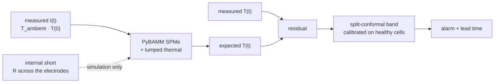
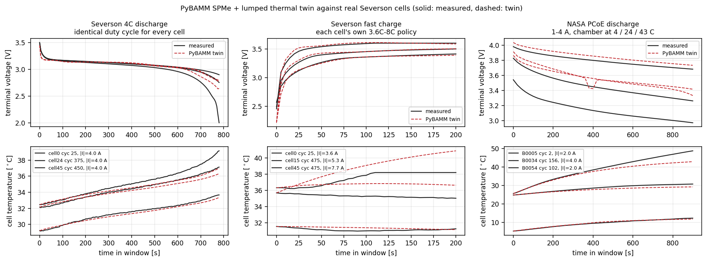
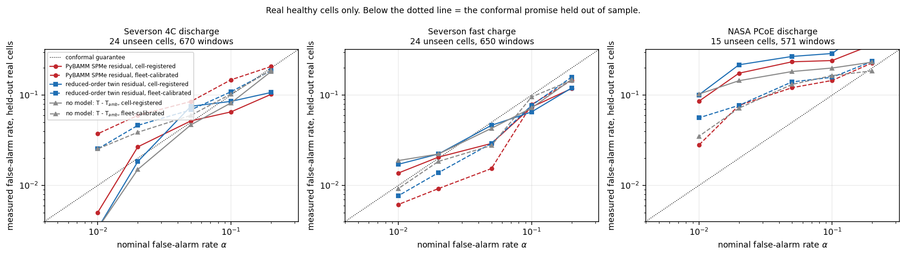
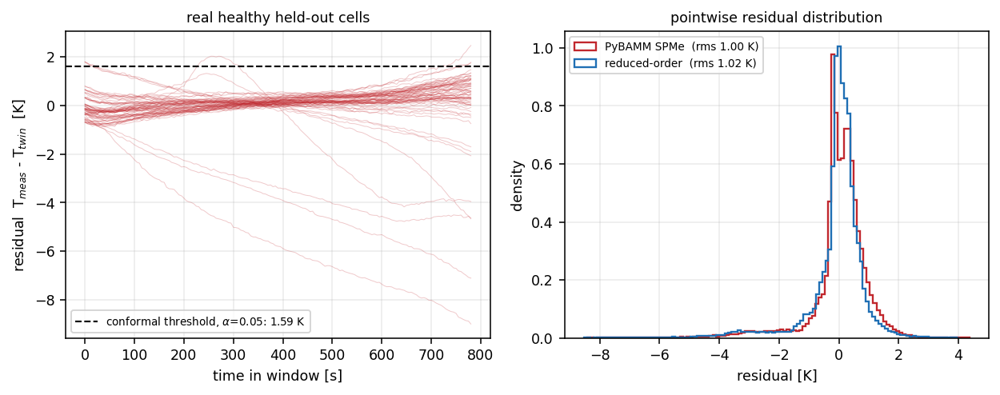
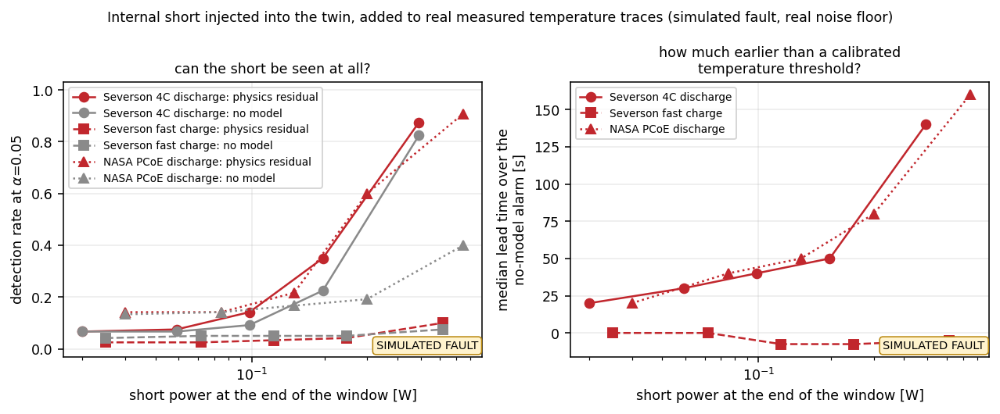
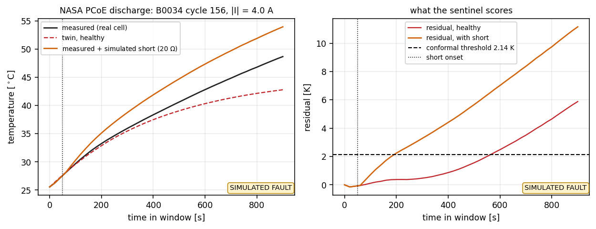

# Thermal Runaway Sentinel

**Physics-residual early warning for Li-ion internal shorts, measured on real
cells.** A PyBAMM electro-thermal twin predicts the temperature a *healthy* cell
should show from its own current; the residual against a **split-conformal
band** — calibrated on a healthy fleet, distribution-free, with a false-alarm
rate you set — flags abnormal heat that a temperature threshold has not seen yet.



## Read this first: what is measured and what is simulated

Real thermal-runaway datasets with a labelled internal-short onset are scarce
and essentially not downloadable. Public battery corpora — NASA PCoE, CALCE,
TRI/Severson — are *ageing* data: real V/I/T under real cycling, with almost no
runaway events. So the claim here is deliberately split in two, and the two
halves are never mixed:

| | what it is | where the numbers come from |
|---|---|---|
| **False-alarm rate** | how often the band fires when nothing is wrong | **real cells.** 46 LFP 18650s (Severson/TRI) and 30 LCO 18650s (NASA PCoE). For each corpus the twin is fitted on ~22% of the cells, the threshold is calibrated on ~26%, and the rate is measured on the rest — cells used for nothing else |
| **Lead time** | how early the alarm fires once a short exists | **simulation.** A resistance across the electrodes, injected into the twin, added to a real measured temperature trace so the alarm still has to clear that cell's real residual noise floor |

The previous version of this repo reported "655 steps of lead time" from a
synthetic simulator. That number is still in `demo_smoke.py`, still synthetic,
and no longer anywhere near the results.

Every number below is regenerated by `scripts/report.py` from the JSON each run
writes — see [`RESULTS.md`](RESULTS.md). Nothing is hand-typed.

## Headline

<!-- BEGIN:headline -->
- **The conformal promise survives the move between real cells.** Calibrated at alpha=0.05 on cells held out for it and measured on cells used for nothing else, the false-alarm rate comes out at **0.052** on severson 4c discharge (598 windows, 24 unseen cells), **0.029** on severson fast charge (583 windows, 24 unseen cells), **0.234** on nasa pcoe discharge (526 windows, 15 unseen cells). Those are real-data numbers and they are the ones that decide whether the method is usable.
- **The twin tracks real cells across two chemistries.** On cells it never saw: severson 4c discharge **31 mV / 0.68 K**; severson fast charge **51 mV / 0.67 K**; nasa pcoe discharge **181 mV / 1.35 K**.
- **And the physics upgrade does not buy a quieter temperature residual.** The two-parameter lumped twin this repo started with, fitted on the same trajectories, reaches 0.66 K on severson 4c discharge, 0.53 K on severson fast charge, 2.43 K on nasa pcoe discharge -- no worse on 2 of the 3 window sets. What the physics buys is a voltage prediction, parameters that are physical quantities, and somewhere to inject a fault; a model with no voltage state cannot host a resistance across the electrodes.
- **The heat balance had to be repaired before any of this meant anything.** PyBAMM's default heat generation closes only 84% of the `I (U - V)` energy balance at 4C -- heat of mixing is off by default, the contact resistance contributes a voltage drop without its own dissipation, and `Prada2013` carries no entropic coefficient at all, which is why the real cells' endothermic first minute of fast charge was unreachable. With all three restored the balance closes to **97.6%** and the identified thermal time constant is 548 s on a 91 J/K cell.
- **Lead time, and it is simulated.** A worsening internal short injected into the twin and added to a real measured trace is caught in 94.2% of severson 4c discharge windows, 12.5% of severson fast charge windows, 93.3% of nasa pcoe discharge windows, a median 55 s (severson 4c discharge), -8 s (severson fast charge), 140 s (nasa pcoe discharge) before a model-free temperature alarm calibrated to the same false-alarm rate. No measured runaway event is involved anywhere.
- **Cheap enough to run online.** One 780 s window through the PyBAMM twin takes **0.55 s** on one core -- 1426x faster than the cell lives it -- so a 1000-cell fleet costs 547 core-seconds per cycle. CPU only; no GPU is used or wanted.

Measured on 76 real cells from two laboratories, 3717 constant-current windows in total.
<!-- END:headline -->

## The corpora: 76 real cells from two laboratories

- **Severson et al. 2019** (TRI / Stanford / MIT fast-charging dataset), batch 1:
  46 A123 APR18650M1A LFP/graphite cells, 1.1 Ah, cycled to failure in a 30 °C
  forced-convection chamber, thermocouple on the can, 5 s logging.
- **NASA Ames PCoE Battery Data Set** (Saha & Goebel): 30 LCO/graphite 18650s,
  2 Ah, discharged at 1–4 A with the chamber at 4, 24 or 43 °C, ~19 s logging.

Three constant-current windows are cut out of them, and the difference between
the first and the other two decides most of the result:

<!-- BEGIN:data -->
| window | windows | cells | distinct current profiles | \|I\| range | median peak rise |
|---|---|---|---|---|---|
| Severson 4C discharge (identical duty cycle for every cell) | 1285 | 46 | 2 | 2.5-4.0 A | 4.7 K |
| Severson fast charge (each cell's own 3.6C-8C policy) | 1221 | 46 | 28 | 3.0-8.0 A | 3.7 K |
| NASA PCoE discharge (1-4 A, chamber at 4 / 24 / 43 C) | 1211 | 30 | 11 | 1.0-4.0 A | 6.6 K |
<!-- END:data -->

Every cell in the Severson dataset is discharged the same way — 4C to 2.0 V — so
that window is a duty cycle that repeats identically, forever, and a detector
that just remembers what a cell's temperature usually does will look very good on
it. The other two windows are not like that: the Severson charge is the
experiment's variable (72 policies, a first constant-current step from 3.6C to
8C, sometimes stepping down mid-window), and the NASA corpus varies both current
and chamber temperature between cells. Whether a model of the cell is worth
having is decided on that axis, so the same pipeline is run on all three.

Every window stays strictly inside constant-current control. During the
constant-voltage holds the cycler controls voltage, not current, and a
current-driven twin cannot reproduce a clamped terminal voltage — including
those samples would score the twin on a mismatch that has nothing to do with the
cell.

## The twin, and whether it tracks a real cell

An **SPMe with a lumped thermal submodel**, driven by the measured current:
PyBAMM's `Prada2013` LFP/graphite chemistry for the Severson cells and
`Ramadass2004` LCO for the NASA cells. Six scalars are identified against real
cycles — electrode area, lithium inventory per amp-hour of *measured* discharge
capacity, contact resistance, heat transfer coefficient, thermal mass and a
full-cell entropic coefficient — inside a physical search box, and any parameter
that lands on a bound is flagged in the report rather than quietly reported as
identified. Ageing enters as a measurement, not a fit: each window's inventory is
set from the capacity that cycle actually delivered.

<!-- BEGIN:twinfit -->
| window | corpus | chemistry | PyBAMM V rmse | PyBAMM T rmse | reduced-order T rmse | windows solved | energy-balance closure |
|---|---|---|---|---|---|---|---|
| Severson 4C discharge | Severson (TRI) batch1, LFP 18650 | Prada2013 | 31 mV | 0.68 K | 0.66 K | 100.0% | 97.6% |
| Severson fast charge | Severson (TRI) batch1, LFP 18650 | Prada2013 | 51 mV | 0.67 K | 0.53 K | 100.0% | 94.3% |
| NASA PCoE discharge | NASA Ames PCoE, LCO 18650 | Ramadass2004 | 181 mV | 1.35 K | 2.43 K | 99.3% | 106.2% |
<!-- END:twinfit -->



Three heat terms had to be put back before the residual meant anything.
PyBAMM's default heat generation closes only about half of the `I (U − V)`
energy balance at these rates, because **heat of mixing** is off by default; the
contact resistance option adds a voltage drop without its own dissipation; and
`Prada2013` carries **no entropic coefficient at all**, so the twin had no
reversible heat — while the real cells visibly *cool* for the first minute of a
fast charge, which is precisely that term. With all three restored the balance
closes to the figure in the table above, and the identified heat transfer
coefficient and thermal time constant land where an 18650 should.
`scripts/verify_twin.py` checks this, plus that re-integrating the lumped ODE
from the twin's own reported heat reproduces the twin's own reported temperature
— which is what the ambient-offset trick behind both the contact heat and the
injected fault relies on.

**The reduced-order twin this repo started with is not beaten on temperature.**
Two parameters fitted on the same trajectories by the same criterion track a
held-out cell about as well as the PyBAMM SPMe does. That is a real result and
it is reported as one. What the physics twin buys is elsewhere: it
predicts the terminal voltage too, its parameters are physical quantities rather
than a lumped `R/C`, and — the reason this project needed it — a resistance
across the electrodes can be *injected into it*, which is not something a model
with no voltage state can host.

## False-alarm rate on real healthy cells

The real-data half. Threshold from the calibration cells, rate measured on the
test cells — used neither to fit the twin nor to set the threshold. An alarm is the
residual staying above the threshold for a fixed dwell, so one scalar per window
summarises the rule and can be used directly as a conformal nonconformity score
— which makes `P(alarm | healthy) ≤ α` a finite-sample statement.

<!-- BEGIN:far -->
| window | detector | threshold at alpha=0.05 | measured false-alarm rate | windows fired |
|---|---|---|---|---|
| Severson 4C discharge | PyBAMM SPMe + lumped thermal | 1.59 K | 0.052 | 31/598 |
| Severson 4C discharge | reduced-order lumped twin | 1.78 K | 0.075 | 45/598 |
| Severson 4C discharge | no model (T - T_amb) | 3.57 K | 0.047 | 28/598 |
| Severson fast charge | PyBAMM SPMe + lumped thermal | 1.70 K | 0.029 | 17/583 |
| Severson fast charge | reduced-order lumped twin | 1.27 K | 0.046 | 27/583 |
| Severson fast charge | no model (T - T_amb) | 2.25 K | 0.043 | 25/583 |
| NASA PCoE discharge | PyBAMM SPMe + lumped thermal | 2.14 K | 0.234 | 123/526 |
| NASA PCoE discharge | reduced-order lumped twin | 1.73 K | 0.268 | 141/526 |
| NASA PCoE discharge | no model (T - T_amb) | 7.00 K | 0.183 | 96/526 |
<!-- END:far -->



Two ways to set the threshold are reported throughout, because the gap between
them is the practical finding:

- **fleet-calibrated** — the threshold from other cells, applied as is. Each
  cell has its own thermocouple offset and its own cooling, so the fleet's
  residual distribution is wider than any single cell's.
- **cell-registered** — each cell's own residual offset, taken from its first
  three healthy windows, is subtracted first. This is what a deployed sentinel
  can actually do: it gets to watch a cell while it is known-good.



## Lead time under a simulated internal short

> **Simulated.** The fault is a resistance `R` bridging the electrodes: a shunt
> current `V/R` drawn inside the cell, so the extra kinetics, diffusion and
> ohmic losses are modelled by PyBAMM rather than assumed, plus `V²/R` of ohmic
> heat added to the lumped energy balance. What the detector sees is a real
> measured temperature trace from a real held-out cell **plus** the increment
> that short causes, and the threshold is the one calibrated on real healthy
> cells above. No measured runaway event is involved anywhere.

<!-- BEGIN:leadtime -->
| window | simulated fault | peak short power | temperature rise caused | detected (physics residual) | detected (no model) | median lead over the no-model alarm |
|---|---|---|---|---|---|---|
| Severson 4C discharge | R=500 ohm (constant) | 0.02 W | 0.09 K | 6.7% | 6.7% | 20 s |
| Severson 4C discharge | R=200 ohm (constant) | 0.05 W | 0.21 K | 7.5% | 6.7% | 30 s |
| Severson 4C discharge | R=100 ohm (constant) | 0.10 W | 0.43 K | 14.2% | 9.2% | 40 s |
| Severson 4C discharge | R=50 ohm (constant) | 0.20 W | 0.85 K | 35.0% | 22.5% | 50 s |
| Severson 4C discharge | R=20 ohm (constant) | 0.49 W | 2.11 K | 87.5% | 82.5% | 140 s |
| Severson 4C discharge | worsening 500->1 ohm | 2.21 W | 4.88 K | 94.2% | 95.0% | 55 s |
| Severson fast charge | R=500 ohm (constant) | 0.03 W | 0.01 K | 2.5% | 4.2% | 0 s |
| Severson fast charge | R=200 ohm (constant) | 0.06 W | 0.02 K | 2.5% | 5.0% | 0 s |
| Severson fast charge | R=100 ohm (constant) | 0.12 W | 0.04 K | 3.3% | 5.0% | -8 s |
| Severson fast charge | R=50 ohm (constant) | 0.25 W | 0.09 K | 4.2% | 5.0% | -8 s |
| Severson fast charge | R=20 ohm (constant) | 0.62 W | 0.21 K | 10.0% | 7.5% | -5 s |
| Severson fast charge | worsening 500->1 ohm | 4.41 W | 0.52 K | 12.5% | 8.3% | -8 s |
| NASA PCoE discharge | R=500 ohm (constant) | 0.03 W | 0.21 K | 14.2% | 13.3% | 20 s |
| NASA PCoE discharge | R=200 ohm (constant) | 0.07 W | 0.53 K | 14.2% | 14.2% | 40 s |
| NASA PCoE discharge | R=100 ohm (constant) | 0.15 W | 1.06 K | 21.7% | 16.7% | 50 s |
| NASA PCoE discharge | R=50 ohm (constant) | 0.30 W | 2.11 K | 60.0% | 19.2% | 80 s |
| NASA PCoE discharge | R=20 ohm (constant) | 0.75 W | 5.26 K | 90.8% | 40.0% | 160 s |
| NASA PCoE discharge | worsening 500->1 ohm | 4.79 W | 14.13 K | 93.3% | 98.3% | 140 s |
<!-- END:leadtime -->





The comparison is against a **model-free alarm calibrated to the same nominal
false-alarm rate on the same healthy cells** — the raw temperature rise over
ambient, with the identical dwell rule. That is the honest baseline: beating an
uncalibrated fixed trip point would say nothing.

## What it costs to run

<!-- BEGIN:cost -->
| window | PyBAMM twin, one window |  | reduced-order twin | 1000 cells, one cycle |
|---|---|---|---|---|
| Severson 4C discharge | 0.55 s | 1426x real time | 0.43 ms | 547 core-s |
| Severson fast charge | 0.38 s | 526x real time | 0.11 ms | 380 core-s |
| NASA PCoE discharge | 0.80 s | 1128x real time | 0.13 ms | 798 core-s |
<!-- END:cost -->

## The synthetic demo

`demo_smoke.py` still runs the whole mechanism — twin, residual, conformal band,
persistence rule — on a toy simulator with numpy alone, so it can be read in one
sitting and needs no data and no PyBAMM. Its numbers are **not measurements** and
do not appear above.

```bash
pip install -r requirements.txt        # numpy, scipy
python demo_smoke.py
PYTHONPATH=. python tests/test_smoke.py
PYTHONPATH=. python tests/test_conformal.py
PYTHONPATH=. python tests/test_twin_pybamm.py   # skips without PyBAMM
```

## Reproduce the real-data path

```bash
pip install -r requirements-full.txt
bash scripts/run_all.sh /path/to/severson/batch1.pkl
```

The NASA archive is downloaded by the script if it is not already there; the
Severson pickle is not redistributable and has to be pointed at. CPU only, no
GPU used or wanted.

## Layout

```
trsentinel/
  data/severson.py   46 LFP cells -> rectangular constant-current windows
  data/nasa.py       30 LCO cells, same layout
  datasets.py        the registry every downstream script iterates over
  twin_pybamm.py     SPMe + lumped thermal, 5 identified scalars
  fault.py           internal short: shunt current + V^2/R into the balance
  sentinel.py        reduced-order twin, conformal band, persistence rule
  metrics.py         conformal thresholds, false-alarm rate, lead time
  split.py           every split is by cell, never by cycle
  cell.py            the synthetic simulator, demo only
scripts/
  prepare_data.py    Severson archive -> data/severson_{discharge,charge}.npz
  prepare_nasa.py    NASA archives -> data/nasa_discharge.npz
  fit_twin.py        identify the twin, score it on unseen cells
  verify_twin.py     energy balance, lumped ODE, fault coupling error
  eval_far.py        false-alarm rate on real healthy cells
  eval_leadtime.py   simulated fault injection and lead time
  bench_cost.py      what one twin evaluation costs
  make_figures.py    every figure above
  report.py          regenerates RESULTS.md and this README's tables
  run_all.sh         all of it, in order
```

## What this does not claim

- **No measured runaway.** Every lead time here is simulated, and labelled as
  such at the point it appears.
- **Two operating windows, not a full cycle.** The twin is identified and scored
  inside constant-current control. Constant-voltage holds and rests are out of
  scope.
- **Two chemistries, one form factor.** LFP and LCO 18650s, two labs, no
  pouch or prismatic cells and no module-level thermal coupling.
- **Cell-registered thresholds assume a known-good period.** Three healthy
  windows per cell, which a cell that arrives already faulty will not give you.

MIT licensed.
