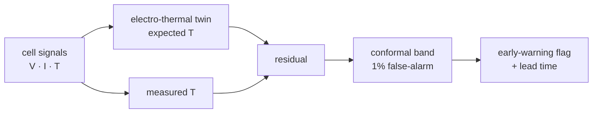

# Thermal Runaway Sentinel

**Physics-residual early warning for Li-ion thermal runaway.** A reduced-order
electro-thermal twin predicts the temperature a *healthy* cell should show from
its own current and voltage; the residual against a **conformal band** (calibrated
on a healthy fleet, distribution-free, controlled false-alarm rate) flags an
internal-short precursor long before the temperature visibly runs away.



## Why residual + conformal
A fixed temperature threshold either alarms late or false-alarms often. Scoring
the **model residual** instead isolates *abnormal* heat (an internal short) from
normal ohmic heating, and the conformal band turns that into a statistically
principled trigger with a false-alarm rate you set (`alpha`).

## Results (synthetic benchmark, `demo_smoke.py`)
Twin fit on a 30-cell healthy fleet, band calibrated at 1% FAR, tested on a cell
developing an internal short at step 1100.

| metric | value |
|---|---|
| fault onset | step 1100 |
| early warning fired | **step 1145** |
| visible runaway | step 1800 |
| **lead time before runaway** | **~655 steps** |
| false alarm on held-out healthy cell | **none** |

## Quickstart
```bash
pip install -r requirements.txt   # numpy only for the offline demo
python demo_smoke.py
PYTHONPATH=. python tests/test_smoke.py
```

## Real data / scaling
- **Twin** — the lumped model here is fit by least squares; the real project swaps
  it for a **PyBAMM** DFN/SPMe physics model or a DeepONet surrogate, calibrated
  against **NASA PCoE / Sandia / CALCE** cycling data (loaders are the natural
  extension of `cell.py`).
- **Conformal** — `alpha` sets the false-alarm rate directly; extend to adaptive /
  time-series conformal for online use.
- **Deploy** — the twin + band are lightweight enough for on-BMS / edge inference;
  training the surrogate is where H100s come in.

## Design
`trsentinel/` — `cell.py` (electro-thermal simulator + fleets) ·
`sentinel.py` (`ThermalTwin`, `ConformalBand`, `early_warning`).

MIT licensed. Synthetic simulator is a stand-in for calibrated physics data — see scaling notes.
