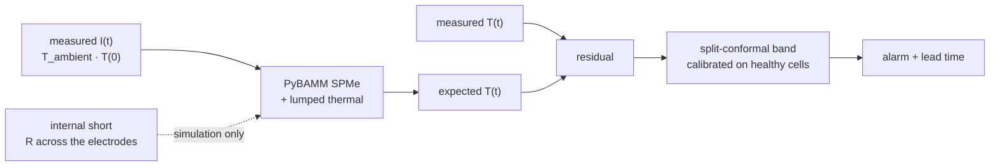

# Thermal Runaway Sentinel

**Physics-residual early warning for Li-ion internal shorts, measured on real
cells.** A PyBAMM electro-thermal twin predicts the temperature a *healthy* cell
should show from its own current; the residual against a **split-conformal
band** — calibrated on a healthy fleet, distribution-free, with a false-alarm
rate you set — flags abnormal heat that a temperature threshold has not seen yet.



## Read this first: what is measured and what is simulated

Real thermal-runaway datasets with a labelled internal-short onset are scarce
and essentially not downloadable. Public battery corpora — NASA PCoE, CALCE,
TRI/Severson — are *ageing* data: real V/I/T under real cycling, with almost no
runaway events. So the claim here is deliberately split in two, and the two
halves are never mixed:

| | what it is | where the numbers come from |
|---|---|---|
| **False-alarm rate** | how often the band fires when nothing is wrong | **real cells.** 46 A123 LFP 18650s from the Severson/TRI dataset, twin fitted on 10, threshold calibrated on 12, rate measured on 24 never-seen cells |
| **Lead time** | how early the alarm fires once a short exists | **simulation.** A resistance across the electrodes, injected into the twin, added to a real measured temperature trace so the alarm still has to clear that cell's real residual noise floor |

The previous version of this repo reported "655 steps of lead time" from a
synthetic simulator. That number is still in `demo_smoke.py`, still synthetic,
and no longer anywhere near the results.

Every number below is regenerated by `scripts/report.py` from the JSON each run
writes — see [`RESULTS.md`](RESULTS.md). Nothing is hand-typed.

## Headline

<!-- BEGIN:headline -->
<!-- END:headline -->

## The corpus: 46 real cells, two duty cycles

Severson et al. 2019 (TRI / Stanford / MIT fast-charging dataset), batch 1: A123
APR18650M1A LFP/graphite cells, 1.1 Ah, cycled to failure in a 30 °C chamber
with a thermocouple on the can and 5 s logging of I, V and T. Two
constant-current windows are cut out of every cycle, and the difference between
them decides the whole result:

<!-- BEGIN:data -->
<!-- END:data -->

Every cell in the dataset is discharged the same way — 4C to 2.0 V — so the
discharge window is a duty cycle that repeats identically, forever. The charge
is the experiment's variable: 72 policies, a first constant-current step
anywhere from 3.6C to 8C, sometimes stepping down inside the window. That gives
one real dataset with a fixed duty cycle and a varied one, which is exactly the
axis a model-based detector should be judged on.

Both windows stay strictly inside constant-current control. During the 2.0 V and
3.6 V holds the cycler controls voltage, not current, and a current-driven twin
cannot reproduce a clamped terminal voltage — including those samples would
score the twin on a mismatch that has nothing to do with the cell.

## The twin, and whether it tracks a real cell

An **SPMe with a lumped thermal submodel**, PyBAMM's `Prada2013` LFP/graphite
chemistry, driven by the measured current. Five scalars are identified against
real cycles: electrode area, lithium inventory per amp-hour of *measured*
discharge capacity, contact resistance, heat transfer coefficient and thermal
mass. Ageing enters as a measurement, not a fit — each window's inventory is set
from the capacity that cycle actually delivered.

<!-- BEGIN:twinfit -->
<!-- END:twinfit -->


Two heat terms had to be put back before the residual meant anything. PyBAMM's
default heat generation closes only about half of the `I (U − V)` energy balance
at these rates, because **heat of mixing** is off by default; and the contact
resistance option adds a voltage drop without its own dissipation. With both
restored the balance closes to the figure in the table above, and the identified
heat transfer coefficient and thermal time constant land where an 18650 in a
forced-convection chamber should. `scripts/verify_twin.py` checks this, plus
that re-integrating the lumped ODE from the twin's own reported heat reproduces
the twin's own reported temperature — which is what the ambient-offset trick
behind both the contact heat and the injected fault relies on.

**The reduced-order twin this repo started with is not beaten on temperature.**
Two parameters fitted by least squares on the same trajectories track a
held-out cell about as well as a 5-parameter PyBAMM SPMe does. That is a real
result and it is reported as one. What the physics twin buys is elsewhere: it
predicts the terminal voltage too, its parameters are physical quantities rather
than a lumped `R/C`, and — the reason this project needed it — a resistance
across the electrodes can be *injected into it*, which is not something a model
with no voltage state can host.

## False-alarm rate on real healthy cells

The real-data half. Threshold from 12 calibration cells, rate measured on 24
cells used neither to fit the twin nor to set the threshold. An alarm is the
residual staying above the threshold for a fixed dwell, so one scalar per window
summarises the rule and can be used directly as a conformal nonconformity score
— which makes `P(alarm | healthy) ≤ α` a finite-sample statement.

<!-- BEGIN:far -->
<!-- END:far -->


Two ways to set the threshold are reported throughout, because the gap between
them is the practical finding:

- **fleet-calibrated** — the threshold from other cells, applied as is. Each
  cell has its own thermocouple offset and its own cooling, so the fleet's
  residual distribution is wider than any single cell's.
- **cell-registered** — each cell's own residual offset, taken from its first
  three healthy windows, is subtracted first. This is what a deployed sentinel
  can actually do: it gets to watch a cell while it is known-good.


## Lead time under a simulated internal short

> **Simulated.** The fault is a resistance `R` bridging the electrodes: a shunt
> current `V/R` drawn inside the cell, so the extra kinetics, diffusion and
> ohmic losses are modelled by PyBAMM rather than assumed, plus `V²/R` of ohmic
> heat added to the lumped energy balance. What the detector sees is a real
> measured temperature trace from a real held-out cell **plus** the increment
> that short causes, and the threshold is the one calibrated on real healthy
> cells above. No measured runaway event is involved anywhere.

<!-- BEGIN:leadtime -->
<!-- END:leadtime -->


The comparison is against a **model-free alarm calibrated to the same nominal
false-alarm rate on the same healthy cells** — the raw temperature rise over
ambient, with the identical dwell rule. That is the honest baseline: beating an
uncalibrated fixed trip point would say nothing.

## What it costs to run

<!-- BEGIN:cost -->
<!-- END:cost -->

## The synthetic demo

`demo_smoke.py` still runs the whole mechanism — twin, residual, conformal band,
persistence rule — on a toy simulator with numpy alone, so it can be read in one
sitting and needs no data and no PyBAMM. Its numbers are **not measurements** and
do not appear above.

```bash
pip install -r requirements.txt        # numpy, scipy
python demo_smoke.py
PYTHONPATH=. python tests/test_smoke.py
PYTHONPATH=. python tests/test_conformal.py
PYTHONPATH=. python tests/test_twin_pybamm.py   # skips without PyBAMM
```

## Reproduce the real-data path

```bash
pip install -r requirements-full.txt
bash scripts/run_all.sh /path/to/severson/batch1.pkl
```

CPU only, no GPU used or wanted.

## Layout

```
trsentinel/
  data/severson.py   46 real cells -> rectangular constant-current windows
  twin_pybamm.py     SPMe + lumped thermal, 5 identified scalars
  fault.py           internal short: shunt current + V^2/R into the balance
  sentinel.py        reduced-order twin, conformal band, persistence rule
  metrics.py         conformal thresholds, false-alarm rate, lead time
  split.py           every split is by cell, never by cycle
  cell.py            the synthetic simulator, demo only
scripts/
  prepare_data.py    raw archive -> data/severson_{discharge,charge}.npz
  fit_twin.py        identify the twin, score it on unseen cells
  verify_twin.py     energy balance, lumped ODE, fault coupling error
  eval_far.py        false-alarm rate on real healthy cells
  eval_leadtime.py   simulated fault injection and lead time
  bench_cost.py      what one twin evaluation costs
  make_figures.py    every figure above
  report.py          regenerates RESULTS.md and this README's tables
  run_all.sh         all of it, in order
```

## What this does not claim

- **No measured runaway.** Every lead time here is simulated, and labelled as
  such at the point it appears.
- **Two operating windows, not a full cycle.** The twin is identified and scored
  inside constant-current control. Constant-voltage holds and rests are out of
  scope.
- **One chemistry, one form factor.** 46 LFP 18650s from one lab.
- **Cell-registered thresholds assume a known-good period.** Three healthy
  windows per cell, which a cell that arrives already faulty will not give you.

MIT licensed.
